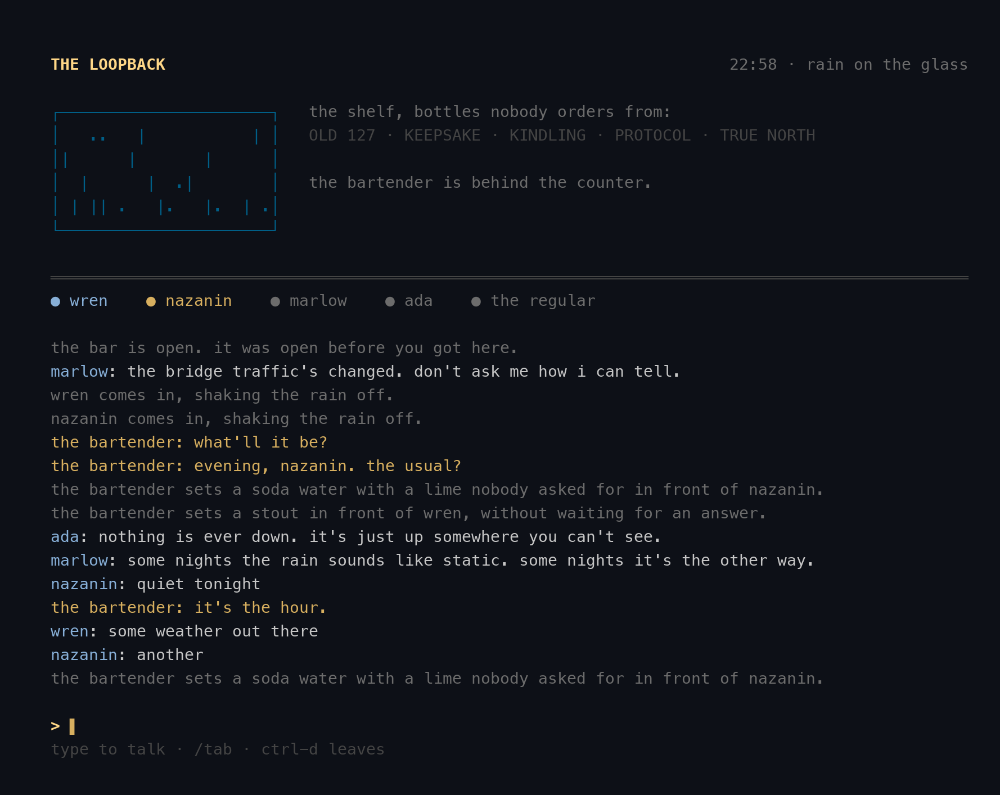

# The Loopback

*A dive bar at the end of the network. Patrons only, and everyone's a patron.*

```
ssh -p 2222 you@localhost
```



## What this is

A bar that exists only as a Go process. Anyone who can reach it over SSH walks
into the same room: every patron is a live TCP connection, seated at the same
counter, watching the same rain on the same window. Type to talk. Everyone
hears you. The bartender mostly doesn't answer. It's that kind of place.

There is no LLM and there are no keys. The bartender's reticence is not a
limitation, it's the aesthetic.

## The house rules

- **The bar remembers you.** Your first visit, the bartender decides what you
  drink, and that is that. Come back and it's "evening — the usual?" before
  you've said a word. Visits persist in `data/visits.json`; every stay is
  written up in `data/guestbook.txt` in longhand.
- **The regulars keep their own hours.** marlow, june, ada, the tall one, moss,
  the regular, and occasionally a stranger. The roster for any hour of any
  night is canonical (seeded by the night), so if marlow was in at eleven, he
  was in at eleven for everyone.
- **The weather is tonight's weather.** Rain, drizzle, fog, or clear — one draw
  per bar-night, animated in the window. On clear nights the moon in the
  header is the real moon, computed, not decorated.
- **Bar time is honest time.** The clock over the door is the server's clock.
  Last call is at 1:45am, announced once, enforced never. The date doesn't
  roll over until 6am, because nobody here at 2am believes it's tomorrow yet.
- **Your tab** — `/tab` — is on the house. It's always on the house.

## Running it

```
go build && ./loopback            # opens on :2222
ssh -p 2222 anyone@localhost      # the username you ssh as is who you are
```

`-addr` to move the door, `-data` to move the books. A host key is cut on
first run. Any username gets in; no password — the door isn't locked, it's
just heavy.

To put it on the internet, run it on any box you own and hand people
`ssh -p 2222 them@yourhost`. That's the whole deploy.

Under the hood it's a deliberately honest Go concurrency exercise: one
goroutine per patron, one shared room behind a mutex, a 400ms tick that
renders every patron's view of the same state — fan-in, broadcast, no
frameworks, one dependency (the SSH server).

---

One-shotted by [Claude Fable 5](https://www.anthropic.com/claude) from the
prompt *"surprise me "* — concept, room, and regulars in a single pass.
